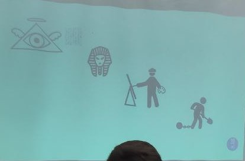

## Addestramento d'emergenza alla fase di Discovery per sviluppatori frustrati 
### Gabriele Giaccari - 20tab

Costi della scarsa qualità del software: molto alti, ordine di grandezza 3000 M$
solo negli USA e solo nel 2020! (Da uno studio)
Succede spesso: si scrive software, poi non si rilascia...

Di fatto oggi parliamo di product management. Scopo del talk: dare
consapevolezza dell'esistenza della fase di discovery.

### Teoria
Percorso tipico di un programmatore medio (lui):
1) 2001: primo sito internet (band). Codice scritto male, requisiti preparati a
   caso...
2) 2010: conosce Python, nasce 20tabs. Sono cresciuti i clienti e le
   responsabilità, ma l'atteggiamento mentale era sempre lo stesso
3) 2014: scopre il manifesto agile --> capisce che qualcosa può cambiare, non
   c'è solo questo modo pieno di frustrazione per portare avanti i progetti

Due tipici errori:
- uno stakeholder dall'alto si sveglia, ha una necessità, ce la descrive. Magari
  passa i requisiti a un project manager che fa dei preventivi. Poi c'è il
  designer e infine lo "schiavo", il team di sviluppo. Lo sviluppo può anche
  avvenire in modo incrementale (es. Scrum), ma comunque le direttive arrivano
  dall'alto --> processo a cascata.
- lo stakeholder aveva un obiettivo (magari di business), non tanto messo a
  fuoco dal team --> quando poi si lancia, il team di sviluppo non sa bene dove
  si sta andando

Conseguenze: il team diventa soltanto una "fabbrica di feature": costruisce
tante cose, il più possibile, senza capire perché e se vengano effettivamente
utilizzate --> non arrivano i soldi, la qualità si abbassa sempre di più, si
chiude tutto il progetto.

Fase di discovery = tutte le attività che svolgiamo per decidere cosa creare, e
tutte le decisioni che prendiamo per definire quale sia la prossima cosa da fare
--> obiettivo: eliminare gli sprechi (filosofia lean). 
"Il software più economico di tutti è quello che non è stato scritto."

La fase di discovery si alterna con quella di delivery = tutte le attività che
svolgiamo per costruire quello che abbiamo deciso nella fase di discovery, per
rilasciare qualcosa di valore per i nostri utenti.

Impostazione mentale dietro a tutto questo processo:
**product thinking** = mentalità di prodotto anziché di progetto --> punto di
più ai risultati che ottengo rispetto alle tempistiche/lista di funzionalità.
Considero il valore di quello che sto producendo non da quante cose faccio, ma
da quanti risultati ottengo. Se noi stiamo creando qualcosa, è perché vogliamo
ottenere qualcosa: il software è soltanto un mezzo per ottenere un cambiamento
in qualcos'altro. **Outcomes over outputs**: risultati >> codice che scriviamo:
a nessuno importa del codice che scriviamo, ma solo dei risultati che possiamo
ottenere tramite esso. **Product team vs feature team**. 

Definizione di "prodotto" da Wikipedia: 
Un prodotto, in economia, è un insieme di attributi tangibili e intangibili di
un bene o un servizio volti a **procurare un beneficio a un utilizzatore**,
ottenuto tipicamente attraverso un processo di produzione o creazione a
partire da risorse iniziali e **con valore aggiunto finale**.
--> è un tipo di approccio che riguarda tutti, non soltanto team di prodotto. 

Marty Cagan: quando facciamo discovery rispondiamo a 4 rischi principali
(domande da farci sul nostro prodotto):
1) value: gli utenti lo sceglieranno?
2) usability: riusciranno a usarlo?
3) feasibility: è possibile realizzarlo?
4) business viability: funziona per il nostro modello/obiettivi di business? 

### Pratica: il processo in 5 fasi:
1) Capiamo perché lo stiamo facendo:
   1) quali risultati vogliamo ottenere? E devo esserne convinto, ingaggiato
   2) come vogliamo modificare il comportamento degli attori coinvolti? Tutte le
      funzionalità puntano a modificare il comportamento di qualcuno in qualche
      modo. Chi ne beneficerà, e in che modo? Immedesimarmi nell'utente e nel
      business 
   3) come lo misuriamo? Non è necessariamente una misurazione di alto livello,
      con analytics etc. Basta chiedere feedback direttamente agli utenti, per
      es. se usano una certa funzionalità o meno.
2) Studiare cosa succede ora: adesso cosa ho? Su cosa si basano gli utenti
   adesso? È fondamentale che gli sviluppatori siano coinvolti in questa fase,
   anche se non sono coinvolti nella fase degli obiettivi di business (perché
   magari è più complessa). Dobbiamo tenere in considerazione le esperienze
   degli utenti, non solo le soluzioni.
3) Generare idee da confrontare e testare: anche qui è fondamentale coinvolgere
   i tecnici. Lavoro di team tra product owner, UX, sviluppatori:
   - non accontentarsi della prima idea che ci viene in mente, generare più idee
     (soluzioni) possibile da confrontare 
   - di quelle più promettenti, generare un prototipo per poterle testare
   - testare le supposizioni più rischiose su cui si basa l'idea, non ancora
     tutta la soluzione (es. chi sono gli utenti)
4) Definire i dettagli
5) Concordare il piano d'azione (su un'idea validata)

Tecniche e tool che si possono usare:
- impact mapping
- event storming
- user journey
- opportunity solution tree
- user story mapping
--> mettere "su carta" la mappa delle mie idee, che porta verso l'obiettivo
chiaro. 

Conferenza il 25 giugno: product management day (da Roma/da remoto)

---

### Q&A
E se non è la domanda a generare un'offerta, ma il viceversa? 
Comunque ci deve essere un bisogno latente, magari andando a cercarlo molto
indietro. Le mega aziende tipo Amazon, Google sono molto brave a cercare questi
bisogni latenti e a portare sul mercato cose di cui non pensavamo per niente di
avere bisogno --> idea innovativa che ha successo. 

E se alcune persone del team non credono in ciò che bisogna fare? 
La cosa difficile è proprio far capire ai piani alti che devono dirci
l'obiettivo, non proporci già la soluzione --> questo fa la differenza tra team
di prodotto e team di feature (mercenari). Il team di prodotto può mettere bocca
nella fase di discovery. Gli sviluppatori spesso hanno più conoscenze per capire
cosa abbia più senso fare --> chiedergli di fidarsi, oppure portare numeri a
supporto della propria idea.