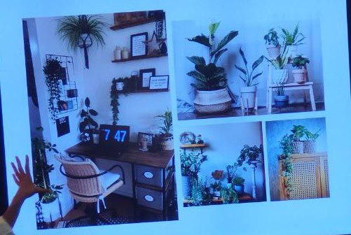
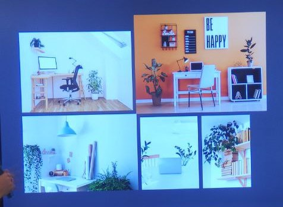
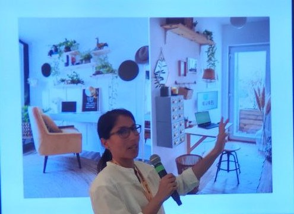
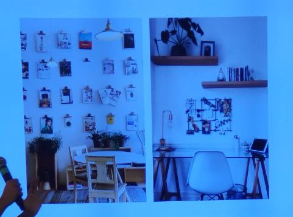
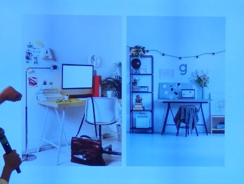

## Trasforma il tuo home office con le piante e scatena la tua creatività 
### Tahío Avila 

[Pinterest, per ispirazione](pinterest.it/FreshLemonadeGardens)
[Instagram, anche per domande](instagram.com/freshLgardens)

Fresh Lemonade Gardens: lei è architetta d'interni e aiuta le persone a rendere
più belli spazi piccoli con le piante.

### Motivazione e natura
Connessione tra natura e come ci fa sentire: l'ambiente può aumentare o
diminuire lo stress (studi Minnesota, Giappone), es. in Asia alcuni medici
prescrivono wood bathing. 

Necessità di andare fuori nella natura, soprattutto durante il lockdown: tutti
gli oggetti in casa "ci dicono qualcosa" e potenzialmente ci stressano. 
La natura può ricaricarci, ci sono elementi naturali "grandi" come il mare, la
foresta in cui ci sentiamo parte di qualcosa di più grande, non ci sentiamo
giudicati, etc.

### Capire le piante e tenerle vive
Hanno bisogno di: luce, acqua, un buon terriccio, una temperatura stabile. 

La pianta giusta nel posto giusto: non è questione di avere il pollice verde!
Magari stiamo solo mettendo le piante sbagliate nel posto sbagliato. A seconda
della **luce** che abbiamo nella nostra stanza e nei diversi punti della stanza: 
- luce diretta: vicino a una finestra dove passano direttamente i raggi del sole 
- luce media: zone dove non serve accendere la luce, arrivano raggi di sole
  durante la giornata ma non per ore e ore
- luce indiretta: la zona opposta a quella dove arrivano i raggi del sole

Le piante d'appartamento sono normalmente piante delle foreste tropicali che
crescono sotto l'ombra degli alberi --> vanno bene per zone a illuminazione
bassa. A seconda della luce che ho nella stanza, scelgo in vivaio la pianta
giusta per quella luce. 

Importante avere sempre un vaso con i buchi per il drenaggio dell'acqua! Senza,
le radici marciscono ed è un altro motivo per cui spesso le piante muoiono. 

### Scegliere la pianta giusta
Oltre allo spazio di lavoro, scegliere anche la/le piante giuste per il nostro
stile di vita: se non abbiamo tanto tempo, ad esempio, non possiamo avere troppe
piante. 

In ogni caso, creare un rituale per curare le piante --> anche curare noi
stessi. 🥰

Stile **urban jungle** per spazio di lavoro --> va molto di moda adesso. Per 
iniziare, prendere poche piante, non piccole. 5-10 okay.

Stile **minimalista**: poche piante ma in punti strategici, e particolari.

Alcune piante easy-going che tollerano bene luce diretta e indiretta:
- ZZ plant: va in su e in giù 
- Monstera deliciosa (molto trendy su Instagram): cresce molto, si espande -->
  avrà bisogno di una struttura per tenerla. Da piccola le foglie sono piene,
  poi sviluppano i "buchi" (ha bisogno di più luce)
- Spider plant: da tenere in alto perché va all'ingiù (come tutte quelle che
  vanno all'ingiù). Si riproduce molto bene
- Devil's ivy: può andare sia giù sia su --> ok da tenere in alto o da fare
  arrampicare 
- Snake plant: va bene per angoli o spazi stretti

### Tecniche base per organizzare lo spazio
Prima: pulire e svuotare lo spazio -- altrimenti le piante non basteranno a
farci stare meglio! --> Marie Kondo. 
Lasciare un tavolo, una sedia (comoda), uno scaffale dove mettere documenti. Non
serve comprare cose nuove, per es. se non mi piace il tavolo posso cambiargli
colore. 

Aspetti base per disegnare lo spazio: colori - texture - altezze: 
- **colori**: diverse sfumature di un solo colore per organizzare lo spazio. Già
  solo le piante danno colori
- **texture**: cuscini, coperte per l'inverno, tappeti, lampade. Materiali
  idealmente naturali (legno, pietra). Anche le piante hanno le loro texture 
- **altezze**: l'importante è che lo spazio non sia piatto e noioso --> piante
  in alto, in basso, in mezzo. Se ho due piante della stessa altezza -->
  metterne una in basso e una su un tavolino

Più le piante sono diverse, meglio è --> sembra più naturale. 

**Accessori**: minimalismo --> tutte le cose nel mio spazio devono essere belle
e funzionali, non deve esserci nulla di più (andrebbe solo a distrarre la nostra
vita). Esempio: fiori secchi anziché finti --> possono rendere un angolino più
interessante. 

Come organizzare lo spazio:
1) identificare cosa vogliamo tenere (scrivania, sedia, scaffale). Tutto deve
   essere funzionale; se non ci piace proviamo a cambiare la disposizione
2) organizzare gli strumenti di lavoro: computer, auricolari/cuffie. Lasciarli
   in un posto dove li terremo --> anch'essi possono creare arredamento (es.
   porta-cuffie, penne e colori che ci piacciono, carta)
3) buttare tutto ciò che non usiamo: è molto facile accumulare cose che non ci
   servono, anche per es. cose a cui teniamo nelle scatole: possiamo usarle come
   decorazione 
4) aggiungere piante. Tendenzialmente quelle grandi (che crescono all'insù)
   stanno in terra, quelle "rotonde" o di misura media a un'altezza media,
   quelle che ricadono all'ingiù vanno in alto.

Spazio di lavoro --> punti verdi in diverse zone e a diverse altezze --> guidano
l'occhio e rendono lo spazio meno noioso. 
Colori chiari (l'importante è anche che ci piacciano): ci tranquillizzano. 

Esempio di riorganizzazione spazi:
- posizione fissata dei tavoli
- soffitto un po' basso
- cavi visibili
- quadri alle pareti
- spazi di luce diretta - media - indiretta

Rispettivamente in questi spazi: 
1) stile urban jungle: monstera + spider - zz plant per nascondere i cavi -
   scaffale in alto: cactus e succulente (piantine che non creano un punto
   focale, ce le consiglia solo come aggiunta)
2) stile minimalista: pianta alta nel mezzo: nasconde i cavi e separa gli spazi

Usare come decorazione quello che ci ispira: es. oggetti da viaggio. Non
necessariamente tanti (anzi) --> ciò che ci ispira scatena la nostra
motivazione. Se lavoriamo contro a un muro, per es. possiamo mettere anche frasi
che ci ispirano. Poi i tappeti e i vasi delle piante possono essere molto
decorativi. Esempio di soluzione per homeoffice anche con poco spazio.

Ricordi e fotografie appesi: tenere solo quelli più importanti. Non tenerli in
una scatola che poi non apriremmo più! Un'altra idea: moodboard (anche per i
nostri progetti di vita -- non solo di lavoro). Esempio: sto lavorando perché
voglio fare un viaggio in Giappone --> mi appendo sul moodboard cose che mi
ricordano questo obiettivo. Mettere cose che ci ispirano che sono **solo
nostre**, non cose esterne o che appartengono ad altri! 

Altri esempi con spazi piccoli: nel primo esempio anche alcuni dettagli rossi
(se ci piace il rosso). Nel secondo: luci particolari.

Le piante saranno una scusa per stare con noi stessi: dedicare loro 5 minuti al
giorno vuol dire anche dedicarli a noi stessi. 

---

### Q&A
Se stiamo fuori casa tanto tempo: scegliere piante che non hanno bisogno di
tanta acqua. Es. la snake plant: d'inverno una volta ogni due mesi, d'estate una
volta al mese (a seconda di dove la posizioniamo -- va bene con qualsiasi
condizione di luce). 

Diverso con le piante da orto: più grande è il vaso, meglio è --> più terra
protegge le radici che quindi si seccano meno. Le piante d'appartamento invece
crescono più lentamente --> è più difficile che si secchino le radici.

Differenza tra routine e rituale: la prima è una cosa che dobbiamo fare (es.
prima di andare al lavoro). Invece il rituale lo scelgo io e me lo godo. Posso
anche avere un rituale prima di andare al lavoro, mi godo il momento e sono
presente: es. farmi il caffè e godermelo; non lo faccio perché _devo_ farlo. 