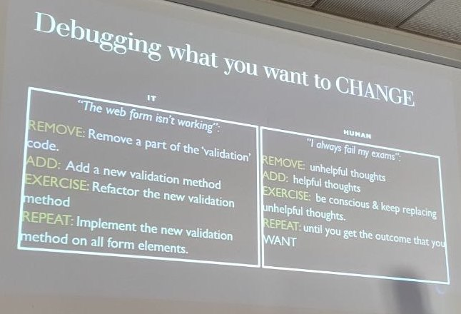

## Exploring patterns to debug your life
### Miriam Perrone, Dennie Declercq

Miriam --> public speaking coach in Belgium for people in the autism spectrum
(Assodem) + publishing books for children (MPe.Books). Today we'll merge
software development with psychological aspects. 

Dennie --> president and developer DDSoft (mixes software with social sciences). 

### What are life patterns?
- Law of gravity: we use it for many different things in different industries 
- Law of proximity: used in marketing 
- Law of attraction: it's pseudoscience, but it has some credit like pseudocode:
  it's not working yet, but it has some meaning 

Vedo la parola "Quantum" sullo schermo 👀 

Behavioural framework: interaction between the ways we think (thoughts), feel
(feelings) and do (behaviour). 

Example: I don't smile when I'm nervous --> I didn't get hired after an
interview because I didn't look motivated because I wasn't smiling --> now I
have another interview and I'm thinking they'll think I'm not motivated, so I'll
be nervous so I won't smile and probably the outcome will be that I won't be
selected for the job.

Exercise: closing your eyes and saying yes/no to all feelings and thoughts you
are experiencing --> saying yes has a more relaxing effect --> our thoughts have
an effect on how we feel.

So we can try and hack our thoughts, e.g. we change the thought "they'll think
I'm not motivated..." with "I am very motivated to get this position, I have all
the capabilities and skills to get it" --> I'll feel more confident and relaxed
--> my facial muscles will relax and I will be able to smile, making a friendly
impression on the interviewer --> the outcome will probably be that I get
selected after the interview.

Don't waste energy on thinking what might have gone differently or go wrong in
the future --> you can change your outcome by changing your thoughts --> "debug
your life".

### Debugging
You must know that you **can** hack your brain. Example connection to IT:

- remove part of code that is not working / unhelpful thought
- add a new method that works / helpful thought
- exercise: refactor this new method to keep it clean / be conscious, and keep
  replacing and cleaning unhelpful thoughts
- repeat: use this working method on all parts where it's needed / it's a trial
  and error process you have to repeat some times until you finally change your
  pattern and are finally able to get the outcome you deeply want

### Recap
1) **explore** your life patterns
2) **connect the dots** (behavioural framework)
3) **debug your life** by changing thoughts/mindset

---

### Q&A
Can you always do this debugging by yourself, or is it sometimes necessary to
work with someone else? It depends. Sometimes you can do it by yourself, other
times with friends or with a psychologist.

Meditation can help a lot getting to know your thoughts and also changing them,
as well as calming down when you have many thoughts that give you bad feelings.
But it does not work for everyone, you have to find what works for you. 

How to debug your thoughts when you have insomnia? You often cannot sleep when
you have many unhelpful thoughts running through your head. What can help is
thinking about three things that happened during the day, or even just one, that
you feel thankful for. And it's also important to have a good sleep hygiene and
routine. 

Jealousy: can be unhealthy if I'm just envious and hateful towards someone else,
but it can also be positive if it leads to ambition, if it's some kind of
aspiration. 

Debugging your thoughts vs. saying affirmations: these can also help the law of
attraction and to influence your thoughts (e.g. in the example above: "I will
get this job"). Of course, both these things will not guarantee that you reach
the outcome you want -- but they help you feel a bit more calm and comfortable,
which helps your behaviour that can in some way influence the environment around
us. It's similar to what we say in business: fake it until you make it. 